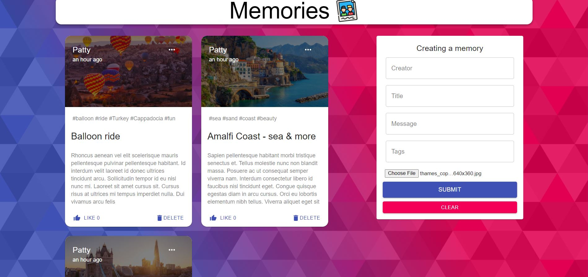

## Synopsis

This is a MERN Memories / Blog website.
It is coded just for fun (hence j4f in the title) / experimentation. 

It was created using:

* React JS
* Material-ui (styling)
* MongoDB Atlas (persisting user data)
* Axios (requests)
* Netlify (deployment)

## Live Demo

To see the live demo, please [click here](https://memories-just-for-fun.netlify.app/).

## Authors

Coded by Patricia Georgescu

Following the videos [here](https://www.youtube.com/watch?v=ngc9gnGgUdA) & [here](https://www.youtube.com/watch?v=aibtHnbeuio)

Few adjustments were done to the initial implementation as follows:
 * [ improvement ]  Add Redux DevTool setup to connect Chrome extension to debug, if needed 
 * [ improvement ] clean tags before submitting them & save them in separate state to properly render them as user types
 * [ improvement ] adjust update like count for a quicker update
 * [ fix ] click on a post to edit it, then clear the form, then click on the same post to edit it, but it won`t work because the id of the post does not get updated
 * [ fix ] proxy link to get the call to the server right (in the initial localhost development phase)
 * [ fix ] hashtags repopulate tag input after user clicks edit post

## License & Copyrights
All materials and ideas pertain to their rightful owner: Adrian Hajdin from [Javascript Mastery](https://www.youtube.com/channel/UCmXmlB4-HJytD7wek0Uo97A). This is just something I coded for fun.

## Quick Live Preview
